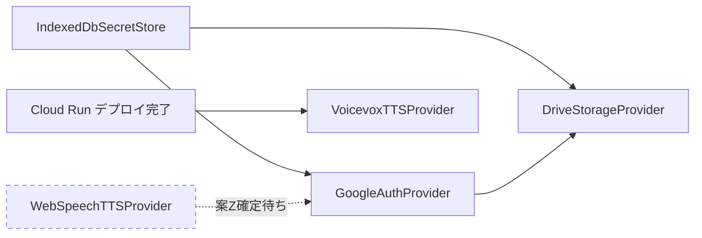

# B2 contract ベース 実装設計 v0.1

## 0. このドキュメントについて

### 0.1 目的

Sさん が 2026-05-24 に起草した B2 contract 6 本(`src/interfaces/*.ts`)に対し、Uさん 担当の実装クラス 5 本の **「実装着手時の道しるべ」** を起こす。実装コード本体は技術顧問の GO サイン後に着手するため、本書は設計レベルにとどめる。

### 0.2 対象(5 本)

| # | 実装クラス | 配置先 | 依存先 | 着手順序 |
|---|---|---|---|---|
| 1 | `IndexedDbSecretStore` | `src/implementations/IndexedDbSecretStore.ts` | なし | **最初** |
| 2 | `GoogleAuthProvider` | `src/implementations/GoogleAuthProvider.ts` | SecretStore | 2 番目 |
| 3 | `DriveStorageProvider` | `src/implementations/DriveStorageProvider.ts` | AuthProvider + SecretStore | 3 番目 |
| 4 | `VoicevoxTTSProvider` | `src/implementations/VoicevoxTTSProvider.ts` | なし(Cloud Run デプロイ済前提) | 並列着手可 |
| 5 | `WebSpeechTTSProvider` | `src/implementations/WebSpeechTTSProvider.ts` | なし | **保留**(B2 引き継ぎメモ §6.2 案 X/Y/Z 確定後) |

Sさん 引き継ぎメモ §7 の推奨順序と一致(Uさん 確認、追従)。

### 0.3 本書の取り扱い

- **GO サインなしで実装コード本体には着手しない**(Sさん との取り決め継承)
- 設計確定後、技術顧問が Sさん と Uさん の合意点を再確認 → GO サイン → Uさん 実装本体着手
- 本書の節構造は実装着手時にチェックリストとして使える粒度で書く
- 不確定事項は明示し、Sさん 確認待ち / たかしさん判断待ちのマーカーを付ける

### 0.4 横断方針

引き継ぎメモ §0 と整合する横断方針:

- **`'unknown'` reason の網羅 catch**: 全実装で `switch` の `default` または exhaustive type-guard を使う。reason 増加時に静かに壊れない構造に
- **`Clock` 抽象の遵守**: 各実装の constructor で `clock = deps.clock` を保持、`clock.now()` を使う。`new Date()` 直接呼出禁止
- **`ResourceMeta.source` の正確性**: `'drive'` / `'cache'` / `'pending'` を UI 側が表示するため、適当な埋めをしない
- **「未来縛らない」原則**: コメント・エラーメッセージ・ログ文字列にも適用(断定表現を避ける)
- **throw ではなく Result 型**: contract の通り、すべて `Promise<...Result>` で返す。実装上の例外は内部で catch して reason に変換

---

## 1. IndexedDbSecretStore 実装設計

### 1.1 責務

contract `SecretStore`(`src/interfaces/SecretStore.ts`)を満たす本番実装。端末内 IndexedDB に Web Crypto AES-GCM で暗号化保管する。Drive には絶対に置かない(contract コメント §1 明示)。

### 1.2 クラス構造

```
class IndexedDbSecretStore implements SecretStore
├─ private db: IDBDatabase | null            // 初期化後にセット、未初期化なら null
├─ private masterKey: CryptoKey | null        // 端末派生鍵、initialize で導出
├─ private deps: SecretStoreDeps             // constructor 注入(Sさん 引き継ぎメモ §1 Clock 抽象遵守)
├─ private readonly dbName = 'invokeaide.secrets'
├─ private readonly dbVersion = 1            // ⚠ 初期からバージョン管理(引き継ぎメモ §3)
├─ private readonly storeName = 'secrets'
├─
├─ constructor(deps: SecretStoreDeps)
├─ async initialize(): Promise<SecretStoreInitResult>
├─ async putSecret(key, value): Promise<SecretOpResult>
├─ async getSecret(key): Promise<string | null>
├─ async removeSecret(key): Promise<SecretOpResult>
├─ async clearAll(): Promise<SecretOpResult>
├─ async hasMasterKey(): Promise<boolean>
├─
├─ // 内部ヘルパー
├─ private async openDb(): Promise<IDBDatabase>
├─ private async deriveOrLoadMasterKey(): Promise<{ key: CryptoKey; firstTime: boolean }>
├─ private async encrypt(plaintext: string): Promise<{ iv: ArrayBuffer; ciphertext: ArrayBuffer }>
├─ private async decrypt(iv: ArrayBuffer, ciphertext: ArrayBuffer): Promise<string | null>  // 失敗時 null(引き継ぎメモ §3)
└─ private toReason(err: unknown): SecretOpResult['reason']
```

`SecretStoreDeps` は contract に未定義のため、Uさん 拡張として定義(構成最小):

```typescript
interface SecretStoreDeps {
  clock: Clock;
  logger?: Logger;
}
```

### 1.3 IndexedDB スキーマ(v1、引き継ぎメモ §3 対応)

```
DB: invokeaide.secrets (version 1)
ObjectStore: secrets
  keyPath: 'key' (SecretKey 型の文字列)
  records: {
    key: string,         // 'oauth.refreshToken' 等
    iv: ArrayBuffer,     // AES-GCM の IV(12 バイト、レコード毎にユニーク)
    ciphertext: ArrayBuffer,
    createdAt: string,   // RFC3339、clock.now().toISOString()
    updatedAt: string
  }
```

`onupgradeneeded` ハンドラは v1 → v2 移行を最初から想定:

```
db.onupgradeneeded = (event) => {
  const db = event.target.result
  const oldVersion = event.oldVersion
  if (oldVersion < 1) {
    db.createObjectStore('secrets', { keyPath: 'key' })
  }
  // 将来 v2 で field 追加時は以下のように:
  // if (oldVersion < 2) { ... migrate ... }
}
```

### 1.4 端末派生鍵(master key)導出

引き継ぎメモ §3「端末派生鍵 = `localStorage` に保存された `crypto.randomUUID()` ベース、端末を変えると復号できなくなる」を実装:

```
1. localStorage.getItem('invokeaide.deviceSeed') を確認
2. なければ crypto.randomUUID() を生成して保存 → firstTime = true
3. あれば既存値を取得 → firstTime = false
4. seed をソルト固定の PBKDF2(SHA-256, iterations=100000)で 256bit に伸ばす
5. AES-GCM 用 CryptoKey として import → masterKey
```

注意:
- `localStorage` の `deviceSeed` を消すと **既存 secret はすべて復号不能**(設計通り、clearAll() 相当)
- `localStorage` クリアは「マルチデバイス時の再認証」UX で発生想定(初回起動扱いになる)
- iOS Safari の Private Browsing では `localStorage` 容量制限 + IndexedDB 制限がきつい → `initialize()` で `{ ok: false; reason: 'storage_quota' }` を返す経路を確保

### 1.5 暗号化方式

- アルゴリズム: AES-GCM
- 鍵長: 256 bit
- IV: 12 バイト、レコード毎に `crypto.getRandomValues()` で生成
- 認証タグ: AES-GCM 標準(16 バイト末尾付加、自動)
- 復号失敗時の挙動: 引き継ぎメモ §3 「`removeSecret()` + `null` 返却で吸収」 → `getSecret()` 内で catch、`removeSecret()` 呼出後 `null` を返す

### 1.6 各メソッド方針

#### initialize()

```
- WebCrypto サポート確認(`window.crypto?.subtle` が存在するか)
  なければ { ok: false, reason: 'unsupported' }
- IndexedDB サポート確認(`window.indexedDB` が存在するか)
  なければ { ok: false, reason: 'unsupported' }
- openDb() で IDBDatabase 取得
- deriveOrLoadMasterKey() で masterKey + firstTime 取得
- this.db / this.masterKey をセット
- { ok: true, firstTime } を返す
- ストレージ容量エラー → { ok: false, reason: 'storage_quota' }
- それ以外 → { ok: false, reason: 'unknown' }(logger.error で詳細を残す)
```

#### putSecret(key, value)

```
- 未初期化なら { ok: false, reason: 'not_initialized' }
- encrypt(value) → { iv, ciphertext }
- IDB transaction(readwrite) で { key, iv, ciphertext, createdAt, updatedAt } を put
- QuotaExceededError → { ok: false, reason: 'storage_quota' }
- それ以外 → { ok: false, reason: 'unknown' }
```

#### getSecret(key)

```
- 未初期化なら null(contract: 「保存されていない = null」)
- IDB transaction(readonly) で get
- record なし → null
- record あり → decrypt(iv, ciphertext)
  - 復号成功 → 平文を返す
  - 復号失敗(タグ検証失敗等) → removeSecret(key) 呼出後 null(引き継ぎメモ §3)
```

#### removeSecret(key)

```
- 未初期化なら { ok: false, reason: 'not_initialized' }
- IDB transaction(readwrite) で delete
- 成功 → { ok: true }
- それ以外 → { ok: false, reason: 'unknown' }
```

#### clearAll()

```
- 未初期化なら { ok: false, reason: 'not_initialized' }
- IDB transaction(readwrite) で clear() を呼ぶ
- localStorage.removeItem('invokeaide.deviceSeed') も実行
  → 次回 initialize() で新規 deviceSeed 生成 = firstTime: true 扱いに戻る
- 引き継ぎメモ §3「OAuth refresh_token も消える、再ログインが必要 UI は呼出側責任」
```

#### hasMasterKey()

```
- localStorage.getItem('invokeaide.deviceSeed') の有無のみ確認
- 副作用なし、initialize() より軽量
- 初回起動判定の補助に使う(contract コメント §3)
```

### 1.7 ベータで対応 / 対応しない範囲

| 項目 | ベータ v1.0 | 商品化版 |
|---|---|---|
| AES-GCM 暗号化 | ✅ | ✅ |
| 端末派生鍵 + localStorage seed | ✅ | ✅ |
| IndexedDB スキーマ v1 + onupgradeneeded 雛形 | ✅ | ✅ |
| マルチデバイス間 secret 同期 | ❌(設計通り) | ❌ |
| 鍵ローテーション機構 | ❌(将来 v2 で検討) | ⚠ 検討候補 |
| BYOK で別の鍵管理サービスに委譲 | ❌ | ⚠ 検討候補 |

### 1.8 テスト方針(Tさん 領域、参考)

- `MockSecretStore`(`tests/mocks/MockSecretStore.ts`): 全メソッドを Map で動かす in-memory 実装、テストで `IndexedDbSecretStore` の代わりに注入
- `IndexedDbSecretStore` 自身の単体テスト: `fake-indexeddb` パッケージ + `@peculiar/webcrypto` で実環境シミュレーション
- 引き継ぎメモ §7「Tさん との切り分けがあるため、Tさん と相談(技術顧問経由)」 → Mock の置き場所(`tests/mocks/` vs `tests/helpers/`)は Tさん 確認後

### 1.9 不確定事項

- **Q-U-j-1**: `SecretStoreDeps` を contract 側 `SecretStore.ts` に追記してもらうか、Uさん 拡張として `src/implementations/IndexedDbSecretStore.ts` 内に閉じるか(Sさん 確認、技術顧問経由)
- **Q-U-j-2**: `localStorage` の `deviceSeed` のキー名(`invokeaide.deviceSeed`)を SecretStore 内に閉じるか、上位の constants に抽出するか

---

## 2. GoogleAuthProvider 実装設計

### 2.1 責務

contract `AuthProvider`(`src/interfaces/AuthProvider.ts`)を満たす本番実装。Google OAuth 2.0 Incremental Authorization を実装し、Stage 機械(`unauth → stage1 → stage2`)を管理。`SecretStore` に依存(refresh_token 保管)。

### 2.2 出典文書との接続

- **Stage 機械の定義**: `Phase2_OAuth_スコープ設計_v0.1_2026-05-19.md` §3.1(Uさん 起草)
- **Stage 0 → 0.5 遷移**: AuthProvider の管轄外(引き継ぎメモ §4)、`ConsentService` 担当(本書スコープ外、Sさん B3 領域)
- **Drive 拒否時 UX**: `Phase2_OAuth_スコープ設計_v0.1` Q-U-a-3 で「(c) 起動継続 + 再要求」採用済

### 2.3 クラス構造

```
class GoogleAuthProvider implements AuthProvider
├─ private deps: AuthDeps | null              // initialize 前は null
├─ private currentStageValue: AuthStage = 'unauth'
├─ private accessTokenCache: { token: string; expiresAt: number } | null
├─ private stageChangeListeners: Array<(stage: AuthStage) => void> = []
├─
├─ constructor()
├─ async initialize(deps): Promise<AuthInitResult>
├─ currentStage(): AuthStage                  // 副作用なし(contract §4 事後条件)
├─ async requestStage1Consent(): Promise<AuthResult>
├─ async requestCalendarConsent(): Promise<AuthResult>
├─ async getAccessToken(): Promise<AccessTokenResult>
├─ async silentRefresh(): Promise<AccessTokenResult>
├─ async signOut(): Promise<void>
├─ onStageChange(cb): Unsubscribe
├─
├─ // 内部ヘルパー
├─ private async buildAuthUrl(scopes: string[]): Promise<string>
├─ private async exchangeCodeForTokens(code: string): Promise<...>
├─ private async refreshAccessToken(refreshToken: string): Promise<...>
├─ private setStage(newStage: AuthStage): void   // listener 通知含む
└─ private toReason(err: unknown): AuthResult['reason']
```

### 2.4 initialize() 詳細

```
1. deps.secretStore.initialize() が完了済みか確認(contract コメント §4 前提)
   → secretStore.hasMasterKey() で確認
   → false なら { ok: false, reason: 'secret_store_unavailable' }

2. deps.config の検証
   - clientId / redirectUri / stage1Scopes / stage2AdditionalScopes が空でないか
   - 不正 → { ok: false, reason: 'config_invalid' }

3. SecretStore から 'oauth.refreshToken' を取得
   - あれば silentRefresh() を試す
     - 成功 → 内部 stage を判定(後述 §2.5)
       - stage1 → restored: true, stage: 'stage1'
       - stage2 → restored: true, stage: 'stage2'
     - 失敗 → SecretStore から refreshToken 削除、unauth で初期化、restored: false
   - なければ → restored: false, stage: 'unauth'

4. this.deps を保存、{ ok: true, restored, stage } を返す
```

### 2.5 Stage 判定(refresh_token から)

refresh_token 自体に scope 情報は含まれないため、付随情報を保管:

```
SecretStore に保存する secret(複数):
- 'oauth.refreshToken' (string): 実際の refresh_token
- 'oauth.grantedScopes' (string): カンマ区切りの scope list
- 'oauth.lastStage' (string): 'stage1' or 'stage2'
```

`silentRefresh()` 成功時に scope を再評価して `currentStageValue` をセット。

代替案: `oauth.grantedScopes` の有無で判定(`stage2AdditionalScopes` の全てが含まれるなら stage2、それ以外で `stage1Scopes` の主要 scope が含まれるなら stage1、それ以外は unauth)。

### 2.6 OAuth フロー実装(Authorization Code with PKCE 推奨)

Google OAuth 2.0 の PKCE(RFC 7636)を採用。SPA(BYOK + Drive)向けに推奨される。

```
requestStage1Consent():
1. PKCE 用 code_verifier / code_challenge を生成
2. authUrl = buildAuthUrl(stage1Scopes + ['openid', 'email', 'profile'])
3. window.location.assign(authUrl) または popup window で navigate
   - リダイレクトベース: ベータでは PWA の `/auth/callback` ルートで code を受け取る
   - Sさん B3 領域: Vue Router で `/auth/callback` ルートを実装、code を AuthProvider に渡す
4. exchangeCodeForTokens(code) で access_token + refresh_token + granted scopes 取得
5. SecretStore.putSecret('oauth.refreshToken', ...)
6. SecretStore.putSecret('oauth.grantedScopes', granted.join(','))
7. SecretStore.putSecret('oauth.lastStage', 'stage1')
8. setStage('stage1')
9. accessTokenCache をセット
10. { ok: true, granted, newStage: 'stage1' } を返す

拒否時:
- code が来ない / error パラメータが返る → { ok: false, reason: 'denied' }
- granted scope に Drive が含まれない → { ok: false, reason: 'partial', granted }
  (引き継ぎメモ §4: 「Drive を拒否したケース、呼出側で再要求ボタンを表示」)
```

### 2.7 requestCalendarConsent() 詳細

Incremental Authorization で Calendar スコープのみ追加要求(`include_granted_scopes=true`):

```
1. PKCE / authUrl = buildAuthUrl(stage2AdditionalScopes, 'include_granted_scopes=true' 付与)
2. リダイレクト
3. callback で新しい code → exchangeCodeForTokens()
4. granted scopes を取得、Calendar が含まれているか確認
5. SecretStore.putSecret('oauth.grantedScopes', updated)
6. SecretStore.putSecret('oauth.lastStage', 'stage2')
7. setStage('stage2')
8. { ok: true, granted, newStage: 'stage2' } を返す
```

### 2.8 getAccessToken() の silent refresh(引き継ぎメモ §4)

```
1. accessTokenCache が存在し expiresAt > now() + 60秒バッファ → cache を返す
2. それ以外は silentRefresh() を呼ぶ
3. silentRefresh() の結果をそのまま返す
   → 呼出側は「access_token が期限切れか」を気にしなくていい(契約意義)
```

### 2.9 silentRefresh() 詳細

```
1. SecretStore.getSecret('oauth.refreshToken') を取得
   - null → { ok: false, reason: 'no_refresh_token' }
2. Google OAuth token endpoint に refresh_token を POST
3. 200 / access_token を取得 → accessTokenCache を更新 → { ok: true, token, expiresAt }
4. 4xx(invalid_grant 等) → refresh_token 失効
   → SecretStore.removeSecret('oauth.refreshToken')
   → setStage('unauth')
   → { ok: false, reason: 'refresh_failed' }
5. ネットワーク障害 → { ok: false, reason: 'network' }
6. それ以外 → { ok: false, reason: 'unknown' }
```

### 2.10 signOut() 詳細

```
1. SecretStore.removeSecret('oauth.refreshToken')
2. SecretStore.removeSecret('oauth.grantedScopes')
3. SecretStore.removeSecret('oauth.lastStage')
4. accessTokenCache = null
5. setStage('unauth')
```

注: signOut() は contract で `Promise<void>` 戻り。失敗ケースは logger.warn() で吸収。

### 2.11 onStageChange() 詳細

```
- stageChangeListeners に cb を push
- Unsubscribe 関数を返す: listeners から該当 cb を取り除く
- 多重購読 OK(同一 cb の重複登録は許容、unsubscribe で1つだけ外す)
```

### 2.12 AuthConfig の値(ベータ環境)

```
{
  clientId: '<Google OAuth Client ID>',  // GitHub Secrets 経由で注入、ハードコード禁止(引き継ぎメモ §4)
  redirectUri: 'https://invokeaide-beta.pages.dev/auth/callback',
  stage1Scopes: [
    'openid',
    'email',
    'profile',
    'https://www.googleapis.com/auth/drive.file',
    'https://www.googleapis.com/auth/tasks',
  ],
  stage2AdditionalScopes: [
    'https://www.googleapis.com/auth/calendar.events',
  ],
}
```

注: Phase2_OAuth_スコープ設計_v0.1 で Q-U-a-1 確定済の scope セット。

### 2.13 ベータで対応 / 対応しない範囲

| 項目 | ベータ v1.0 | 商品化版 |
|---|---|---|
| OAuth Authorization Code with PKCE | ✅ | ✅ |
| Incremental Authorization(stage1 → stage2) | ✅ | ✅ |
| silent refresh + access_token キャッシュ | ✅ | ✅ |
| 拒否時の `reason: 'partial'`(Drive 拒否ケース) | ✅ | ✅ |
| popup ベース認証(リダイレクト以外) | ❌(リダイレクトのみ) | ⚠ 検討 |
| federated identity providers(Apple ID 等) | ❌ | ⚠ 検討 |

### 2.14 不確定事項

- **Q-U-j-3**: `clientId` / `redirectUri` の dev / staging / prod 切替方法(`.env.development` / `.env.production` を Vite が解釈する想定 — Sさん B1 設定確認)
- **Q-U-j-4**: PKCE の code_verifier を localStorage に保持するか、Vuex/Pinia store に保持するか(リダイレクト前後で同一が必要、localStorage が無難)
- **Q-U-j-5**: refresh_token の失効検出時に UI 通知をどう発火するか(`onStageChange('unauth')` で十分か、それとも追加イベントが必要か)

---

## 3. DriveStorageProvider 実装設計

### 3.1 責務

contract `StorageProvider`(`src/interfaces/StorageProvider.ts`)を満たす本番実装。Google Drive API v3 で `MIYU_App_Data/` 配下を読み書き + IndexedDB ローカルキャッシュ + Pending Queue + LWW 競合検知。

### 3.2 出典文書との接続

- **Drive ファイルレイアウト**: `Phase2_Drive_ファイルレイアウト設計_v0.1` F1-F9
- **Storage interface 叩き台**: `Phase2_Storage_interface_叩き台_v0.1` — 本書はその実装側
- **LWW 競合解決**: 叩き台 §6(LWW + retainedPath にローカル退避)

### 3.3 クラス構造

```
class DriveStorageProvider implements StorageProvider
├─ private deps: StorageDeps | null
├─ private cache: IndexedDbCache              // 内部キャッシュ層
├─ private pendingQueue: PendingQueue          // 保存待ちキュー
├─ private fileIdMap: Map<string, string>      // 論理パス → driveFileId
├─ private etagMap: Map<string, string>        // 論理パス → 最後の etag
├─ private syncState: SyncState
├─ private syncStateListeners: Array<WatchCallback<SyncState>> = []
├─ private fileWatchers: Map<string, Set<WatchCallback<any>>> = new Map()
├─ private conflictListeners: Array<(ev: ConflictEvent) => void> = []
├─
├─ // ライフサイクル
├─ constructor()
├─ async initialize(deps): Promise<InitResult>
├─ async ensureLayout(): Promise<EnsureLayoutResult>
├─ async dispose(): Promise<void>
├─
├─ // 設定 / キャラ / プロファイル / マニュアル / 履歴(contract 通り)
├─ ...(各メソッド、 §3.5 で詳述)
├─
├─ // 同期・オフライン
├─ getSyncState(): SyncState
├─ watchSyncState(cb): Unsubscribe
├─ async flushPending(): Promise<FlushResult>
├─ onConflict(cb): Unsubscribe
├─
├─ // 内部ヘルパー
├─ private async driveApi<T>(method, url, opts?): Promise<T>  // access_token 自動取得 + retry
├─ private async resolveOrCreateFile(logicalPath: string): Promise<string>  // driveFileId 取得
├─ private async readJson<T>(logicalPath, opts?): Promise<LoadResult<T>>
├─ private async writeJson<T>(logicalPath, data: T): Promise<SaveResult>
├─ private async readText(logicalPath, opts?): Promise<LoadResult<string>>
├─ private async writeText(logicalPath, content: string): Promise<SaveResult>
├─ private async appendText(logicalPath, line: string): Promise<AppendResult>
├─ private notifyWatchers(logicalPath, value): void
├─ private notifySyncState(): void
└─ private async handleConflict(logicalPath, ours, theirs): Promise<void>
```

### 3.4 Drive ファイルレイアウト(F1-F9、F = File)

`Phase2_Drive_ファイルレイアウト設計_v0.1` より:

```
MIYU_App_Data/  (Drive ルート)
├─ README.md                                  (F1, 説明、appProperties で識別)
├─ config/
│   ├─ index.json                             (F2, characters / coaching の一覧)
│   ├─ settings.json                          (F3, Settings 型)
│   ├─ profile.md                             (F4, YAML frontmatter + body)
│   ├─ manual.md                              (F5, ユーザー向け説明、読みのみ)
│   ├─ characters/
│   │   ├─ <id>.md                            (F6, キャラ MD)
│   │   └─ <id>.coaching.md                   (F7, コーチング MD)
│   ├─ archive/
│   └─ conflicts/                             (LWW 競合の ours を退避)
├─ logs/
│   ├─ errors.md                              (F8, 追記専用)
│   └─ conversations/
│       └─ YYYY-MM-DD.md                      (F9, 日付別追記)
```

論理パス → 実 Drive パスのマッピングは `fileIdMap`(Map)で管理。`appProperties` または `properties` に `invokeaide.role: 'F2'` 等の識別子を付与し、検索時に robust に。

### 3.5 各メソッド方針(主要なものだけ詳述)

#### initialize(deps)

```
1. deps.auth.currentStage() を確認
   - 'unauth' → { ok: false, reason: 'auth_missing' }
   - 'stage1' 以上 → 続行
2. Drive 拒否確認(deps.auth から granted scopes を取得 — AuthProvider に新メソッド追加要否要確認、Q-U-j-6)
   - Drive スコープなし → { ok: false, reason: 'drive_denied' }
3. IndexedDbCache 初期化
4. PendingQueue を IndexedDB から復元
5. SyncState を初期値で設定
6. this.deps を保存、{ ok: true } を返す
```

#### ensureLayout()(冪等、引き継ぎメモ §5)

```
1. drive.files.list で MIYU_App_Data/ の存在確認
2. なければ作成、existed/created に振り分け
3. 配下の config/ / config/characters/ / config/archive/ / config/conflicts/ / logs/ / logs/conversations/ を順に確認
4. README.md / index.json / settings.json / manual.md を初回作成(なければ)
5. すべて完了したら { ok: true, created: [...], existed: [...] }
6. auth エラー → { ok: false, reason: 'auth' }
7. rate_limit → { ok: false, reason: 'rate_limit' }
```

#### loadSettings(opts?)

```
1. cache.get('config/settings.json') を確認
   - cache hit + TTL 内 + !forceFresh → cache を返す(meta.source = 'cache')
2. driveApi で取得
   - 成功 → cache に保存、{ ok: true, value, meta: { ..., source: 'drive' } }
   - 404 → { ok: false, reason: 'not_found' }
   - JSON parse 失敗 → { ok: false, reason: 'parse_error' }
   - rate_limit → { ok: false, reason: 'rate_limit', cached: cache の値 }
   - offline → { ok: false, reason: 'offline', cached: cache の値(allowStaleCache 時) }
```

#### saveSettings(settings)

引き継ぎメモ §2「`lastUpdated` を clock.now().toISOString() で必ず更新」 + LWW 競合検知:

```
1. settings.lastUpdated = this.deps.clock.now().toISOString() で必ず更新
2. settings.schemaVersion = '1' リテラル固定(引き継ぎメモ §2)
3. オフライン → pendingQueue.enqueue(...) → { ok: true, meta: { source: 'pending' } } または
   contract 通り { ok: false, reason: 'offline', pending: true }
   ※ contract 上 SaveResult の ok:true は meta 必須、pending 経路は ok:false で pending:true 推奨
4. オンライン → driveApi で PATCH + If-Match: <etag>
   - 200 → cache 更新、watchers に通知、{ ok: true, meta }
   - 412 Precondition Failed → 競合検出 → handleConflict() → { ok: false, reason: 'conflict' }
   - rate_limit → { ok: false, reason: 'rate_limit' }
```

#### handleConflict(logicalPath, ours, theirs) 内部

引き継ぎメモ §5「LWW = Drive が決める、ローカル保持版は retainedPath で UI に提示」:

```
1. ours(ローカル保存待ちだった内容)を Drive 上の config/conflicts/<timestamp>-<filename> として保存
2. ConflictEvent を組み立て:
   { file: logicalPath, retainedPath: 'config/conflicts/...', occurredAt: clock.now(), ours: {...}, theirs: {...} }
3. conflictListeners に通知
4. cache は theirs(Drive 側)で更新
5. watchers に theirs を通知
```

#### loadCharacterMd / loadCoachingMd(bundled アセット対応、引き継ぎメモ §5)

```
1. cache.get('config/characters/<id>.md') を確認(同上)
2. Drive から取得
   - 成功 → 通常通り
   - 404 → bundled アセット(import.meta.glob 等で同梱)から該当 id の MD を探す
     - 見つかれば { ok: true, value: bundled, meta: { ... source: 'cache' or 'drive'? } }
       (bundled は厳密には 'drive' でも 'cache' でもないが、UI 表示上は 'cache' 扱い + 別フラグで判定)
     - 見つからなければ { ok: false, reason: 'not_found' }
3. 「Drive にない = 'not_found'」と扱わない(引き継ぎメモ §5)
```

注: bundled vs Drive の区別を返すために `LoadResult.meta` に新フィールド追加要否を確認(Q-U-j-7)。現状の `'drive' | 'cache' | 'pending'` だと bundled が表現できない可能性。

#### diffBundledVsDrive(id): CharacterDiffResult

```
1. bundled アセットの <id>.md を取得
2. Drive の <id>.md を取得
3. 両方ある場合: バージョン文字列を比較(YAML frontmatter の version フィールド想定)
4. Drive のみ → 'drive_only'
5. bundled のみ → 'bundled_newer'(driveVersion: undefined)
6. 両方あり同一 → 'same'
7. 両方ありで bundled が新しい → 'bundled_newer'(bundledVersion, driveVersion)
```

#### watchSettings / watchCharacter* / watchSyncState(引き継ぎメモ §5 5項目契約)

```
契約遵守:
(1) 初回必ずコール: cb 登録直後に現在値で 1 回呼ぶ(キャッシュから取得 or load を発火)
(2) 値変更時のみ追加コール: 同じ値の再通知は抑制(deep equality or version 番号比較)
(3) Unsubscribe 後コールなし: listeners から該当 cb を削除、以降通知しない
(4) 多重購読 OK: 同一 cb の重複登録を許容
(5) エラー時もコール: 取得失敗時は前回の値 or デフォルト値で cb を呼ぶ(undefined を渡さない)

実装:
- fileWatchers: Map<論理パス, Set<WatchCallback>>
- save / load 成功時に該当パスの watchers を全部発火
- Unsubscribe は Set から remove
```

#### appendError / archiveConversation(F8 / F9、追記専用)

引き継ぎメモ §5「`flushPending()` は直列実行 + 順番再生」:

```
- オフライン → pendingQueue に enqueue(順序保証)
- オンライン → drive.files.update で末尾追記
  - errors.md は時系列追記、conversations/YYYY-MM-DD.md は日付別 1 ファイル
- 同時呼出は内部キューで直列化
```

#### flushPending()

```
1. pendingQueue から順に取り出し、1件ずつ Drive に保存試行
2. 成功 → flushed++
3. 失敗(競合) → ConflictEvent 発火、skipped++
4. ネットワーク失敗 → 早期 break、{ ok: false, reason: 'network', flushed }
5. 全成功 → { ok: true, flushed, skipped }
6. 直列実行(並列呼出は内部キューでロック)
```

### 3.6 ベータで対応 / 対応しない範囲

| 項目 | ベータ v1.0 | 商品化版 |
|---|---|---|
| Drive API v3 経由の CRUD | ✅ | ✅ |
| IndexedDB キャッシュ(TTL 制御) | ✅ | ✅ |
| Pending Queue(オフライン書き込み) | ✅ | ✅ |
| LWW + ETag 競合検知 + conflicts/ 退避 | ✅ | ✅ |
| watchSettings 等の 5項目契約 | ✅ | ✅ |
| bundled アセット fallback(loadCharacterMd) | ✅ | ✅ |
| 階層メモリ(daily/weekly/monthly/yearly) | ❌ (現行 MIYU 機能、汎用版は Phase 3 以降) | ⚠ Phase 3 |
| Drive のリアルタイム push 通知 | ❌(polling) | ⚠ 検討(Webhook) |

### 3.7 不確定事項

- **Q-U-j-6**: AuthProvider に「granted scopes を返すメソッド」を追加する必要(StorageProvider の initialize で Drive スコープ拒否を検出するため)。Sさん 確認、技術顧問経由
- **Q-U-j-7**: bundled アセット返却時の `LoadResult.meta.source` をどう表現するか(`'drive' | 'cache' | 'pending'` 以外の値が必要か)
- **Q-U-j-8**: `Phase2_Storage_interface_叩き台_v0.1` の `PendingQueueStore` / `ConflictResolver` を独立クラスとして切り出すか、DriveStorageProvider 内に閉じるか(Uさん 感触: 内部に閉じてシンプル、ただしテスタビリティ低下)
- **Q-U-j-9**: IndexedDB キャッシュの TTL(現状は `LoadOptions.allowStaleCache` で制御)を秒単位で何にするか(叩き台では 60 秒推奨だったが、ユーザー UX 影響あり)

---

## 4. VoicevoxTTSProvider 実装設計

### 4.1 責務

contract `TTSProvider`(`src/interfaces/TTSProvider.ts`)を満たす本番実装。Cloud Run に立てた VOICEVOX エンジン経由で音声合成。`providerId = 'voicevox'`。

### 4.2 出典文書との接続

- **Cloud Run デプロイ**: `Phase2_CloudRun_deploy_ワークフロー_v0.1`(Uさん 起草、たかしさん Block C 完了 + Run workflow で稼働)
- **nginx 認証**: `Bearer ${VOICEVOX_AUTH_TOKEN}` ヘッダ必須(同 §1.2)
- **ローカル検証**: `Phase2_docker_compose_ローカル動作確認_v0.1`(同)

### 4.3 クラス構造

```
class VoicevoxTTSProvider implements TTSProvider
├─ readonly providerId = 'voicevox'
├─ private endpoint: string                  // 例: 'https://voicevox-engine-xxx.a.run.app'
├─ private authToken: string                 // 'Bearer <VOICEVOX_AUTH_TOKEN>'
├─ private deps: VoicevoxDeps
├─
├─ constructor(config: VoicevoxConfig, deps: VoicevoxDeps)
├─ async synthesize(text, options): Promise<TTSResult>
├─ async isAvailable(): Promise<boolean>
├─ async dispose(): Promise<void>
├─
├─ // 内部ヘルパー
├─ private async audioQuery(text: string, speakerId: number): Promise<AudioQuery>
├─ private async synthesizeFromQuery(query: AudioQuery, speakerId: number, format: string): Promise<ArrayBuffer>
├─ private buildHeaders(): HeadersInit
└─ private toReason(err: unknown, status?: number): TTSErrorReason
```

`VoicevoxConfig` / `VoicevoxDeps` は Uさん 拡張で定義:

```typescript
interface VoicevoxConfig {
  endpoint: string         // Cloud Run URL or docker-compose URL
  authToken: string        // openssl rand -hex 32 で生成された token
}

interface VoicevoxDeps {
  clock: Clock
  logger?: Logger
}
```

### 4.4 VOICEVOX 公式 API の二段階構造

VOICEVOX engine は以下の 2 ステップ:

```
Step 1: POST /audio_query?text=<text>&speaker=<id>
        → AudioQuery JSON(韻律情報など)を取得
Step 2: POST /synthesis?speaker=<id> + body: AudioQuery
        → audio binary(wav)を取得
```

実装は両方を1つの synthesize() 内で連鎖実行。

### 4.5 synthesize() 詳細

```
1. text が空 → { ok: false, reason: 'invalid_text' }
2. text が長すぎ(例: 5000 文字超)→ { ok: false, reason: 'invalid_text' }
3. speakerId 未指定 → options.speakerId デフォルトを「ベータ初期キャラ MIYU の voicevoxSpeakerId」に解決
   - これは contract 上は呼出側責任だが、デフォルト解決を Provider が持つ案あり(Q-U-j-10)
4. audioQuery(text, speakerId) を呼ぶ
   - 200 + JSON → query 取得
   - 404 → { ok: false, reason: 'unsupported_speaker' }(speakerId が存在しない場合)
   - 401 → { ok: false, reason: 'auth' }(AUTH_TOKEN 不一致)
   - 429 → { ok: false, reason: 'rate_limit' }
   - その他 → { ok: false, reason: 'network' or 'unknown' }
5. query に options を適用(speedScale / pitchScale / volumeScale / intonationScale)
6. synthesizeFromQuery(query, speakerId, preferredFormat='wav') を呼ぶ
   - 200 + arrayBuffer → 取得
   - その他 → 上記同様の reason 変換
7. durationMs を query から推定(query.outputSamplingRate と sample 数から計算可)
8. { ok: true, audioBuffer, mimeType: 'audio/wav', durationMs }
```

### 4.6 isAvailable() 詳細

引き継ぎメモ §6.1「副作用なし、軽量チェック」:

```
1. /healthz エンドポイントに GET(認証不要、nginx.conf.tmpl で公開済)
2. 200 OK → true
3. それ以外(タイムアウト 3秒、4xx、5xx)→ false
4. logger.warn 等でメッセージのみ残す(エラー throw しない)
```

### 4.7 dispose() 詳細

```
- 内部のリクエスト abort(AbortController を使っている場合)
- ペンディングの Promise を reject せず、自然完了させる
- 二重呼出に耐える(idempotent)
```

### 4.8 ヘッダ構築

```
buildHeaders():
  return {
    'Authorization': `Bearer ${this.authToken}`,
    'Content-Type': 'application/json',
  }
```

Cloud Run 経由の場合、CORS は nginx 側で `Access-Control-Allow-Origin: <ALLOWED_ORIGIN>` を付けるため、フロント側追加処理不要。

### 4.9 ベータで対応 / 対応しない範囲

| 項目 | ベータ v1.0 | 商品化版 |
|---|---|---|
| audio_query + synthesis の2段階呼出 | ✅ | ✅ |
| Bearer token 認証 | ✅ | ✅ |
| speakerId / speedScale / pitchScale / volumeScale / intonationScale | ✅ | ✅ |
| WAV 出力 | ✅ | ✅ |
| MP3 / OGG 出力 | ❌(VOICEVOX 公式は WAV) | ⚠ Cloud Run で ffmpeg 変換するか検討 |
| ストリーミング合成 | ❌ | ⚠ Phase 4 |
| 複数 speakerId の同時合成 | ❌(直列) | ⚠ 並列化検討 |

### 4.10 不確定事項

- **Q-U-j-10**: speakerId 未指定時のデフォルトを Provider が解決するか、呼出側責任とするか
- **Q-U-j-11**: Cloud Run コールドスタート時のタイムアウト設定(VOICEVOX 初期ロード ~90 秒、Provider の synthesize リトライ戦略)
- **Q-U-j-12**: ログに発話テキストを残さない方針(Cloud Run deploy ワークフロー §5.1「URL クエリではなく POST ボディ」)。VOICEVOX 仕様上、`audio_query` は URL クエリで text を渡す → ベータでは VOICEVOX 仕様準拠で許容、商品化版で proxy 側に薄いラッパーを噛ませて POST ボディ化を検討(同 §5.2)

---

## 5. WebSpeechTTSProvider 実装設計(保留)

### 5.1 保留理由

引き継ぎメモ §6.2 で **「contract と Web Speech API の構造的矛盾」が指摘されており、案 X / Y / Z のいずれかを Sさん が確定するまで本実装は着手しない**。

- 現 contract: `synthesize()` が `Promise<TTSResult>` で `audioBuffer: ArrayBuffer` を返す
- Web Speech API: `speechSynthesis.speak(utterance)` は「合成 → 再生」が一体型、ArrayBuffer 取得不可

### 5.2 案 X / Y / Z への Uさん 感触

| 案 | Sさん 提示の概要 | Uさん 感触 |
|---|---|---|
| X | TTSProvider 維持、WebSpeech は別 contract(SpeakProvider 等)に分離 | TTSProvider の抽象が VOICEVOX 専用化、将来 BYOK TTS 追加時に再度分離問題が出る可能性 |
| Y | contract を「合成して再生」(`Promise<PlayResult>`)に変更 | VoicevoxTTSProvider 側で再生制御が固定、録音保存・速度可変再生が不可になる |
| Z | `synthesize()` + `synthesizeAndPlay()` 二段構え、`capabilities` で宣言 | 最も柔軟、ベータ v1.0 では `synthesize()` のみ実装(WebSpeech は対応しない)、v1.1 で `synthesizeAndPlay()` を追加可能 |

**Uさん 推奨案 Z**(Sさん 確認待ち、技術顧問経由)。理由:

1. ベータ v1.0 で WebSpeech が未対応でも、VoicevoxTTSProvider + フォールバック UI(「VOICEVOX 接続できません、設定を確認してください」)で運用可能
2. `capabilities` で Provider 自身が「対応 method」を宣言する設計は、将来の BYOK TTS / OpenAI TTS / その他のサービス追加でも破綻しない
3. iOS Safari など VOICEVOX 不通環境での fallback として、v1.1 で `synthesizeAndPlay()` を追加すれば WebSpeech を組み込める

### 5.3 案 Z 確定後の実装設計(暫定スケッチ)

```typescript
// contract 変更案(案 Z)
interface TTSProvider {
  readonly providerId: string
  readonly capabilities: TTSCapabilities  // { synthesize: boolean; synthesizeAndPlay: boolean }
  synthesize?(text, options): Promise<TTSResult>
  synthesizeAndPlay?(text, options): Promise<PlayResult>
  isAvailable(): Promise<boolean>
  dispose(): Promise<void>
}

// VoicevoxTTSProvider: { synthesize: true, synthesizeAndPlay: false }
// WebSpeechTTSProvider: { synthesize: false, synthesizeAndPlay: true }
```

WebSpeechTTSProvider 実装:

```
synthesizeAndPlay(text, options):
  1. window.speechSynthesis サポート確認 → なければ { ok: false, reason: 'not_available' }
  2. SpeechSynthesisUtterance を生成
  3. rate / pitch / volume / lang を設定
  4. speechSynthesis.speak(utterance)
  5. utterance.onend で Promise resolve、onerror で reject
  6. AbortSignal で interrupt 可能にする(将来用)
```

### 5.4 不確定事項

- **Q-U-j-13**: 案 Z(または他の案)の確定タイミング。本書では「保留」表示にとどめ、確定後 v0.2 で具体設計を起こす想定。技術顧問が Sさん に確認

---

## 6. テストハーネス(Tさん 領域との切り分け、参考)

### 6.1 Uさん 側で書く実装テスト

| 対象 | テストファイル | 範囲 |
|---|---|---|
| `IndexedDbSecretStore` | `tests/unit/IndexedDbSecretStore.spec.ts` | initialize / put / get / remove / clear / hasMasterKey 各々 |
| `GoogleAuthProvider` | `tests/unit/GoogleAuthProvider.spec.ts` | Stage 遷移、silent refresh、wash sale 拒否 等 |
| `DriveStorageProvider` | `tests/unit/DriveStorageProvider.spec.ts` | ensureLayout、loadSettings / saveSettings、competing conflict 検出 |
| `VoicevoxTTSProvider` | `tests/unit/VoicevoxTTSProvider.spec.ts` | synthesize 成功 / 401 / 429 / network |

依存ライブラリ:
- `fake-indexeddb`: IndexedDB シミュレーション
- `@peculiar/webcrypto` or `node:crypto` の WebCrypto polyfill: Web Crypto API シミュレーション
- `msw`(Mock Service Worker): Drive API / Google OAuth / VOICEVOX エンドポイントのモック

### 6.2 Tさん 側で書く Mock(Sさん 引き継ぎメモ §7 / Uさん 確認待ち)

| Mock | テストファイル | 用途 |
|---|---|---|
| `MockSecretStore` | `tests/mocks/MockSecretStore.ts` | in-memory Map、テストで IndexedDbSecretStore を差し替え |
| `MockAuthProvider` | `tests/mocks/MockAuthProvider.ts` | Stage を任意に設定可、silent refresh を即座に成功/失敗で切替可 |
| `MemoryStorage` | `tests/mocks/MemoryStorage.ts` | DriveStorageProvider の in-memory 版、watch 系も動かす |
| `FlakyStorage` | `tests/mocks/FlakyStorage.ts` | オフライン UX 検証用、save が一定確率で失敗 |
| `MockTTSProvider` | `tests/mocks/MockTTSProvider.ts` | synthesize が常に固定 ArrayBuffer を返す |

これらの配置場所(`tests/mocks/` vs `tests/helpers/`)は Tさん 確認後(引き継ぎメモ §7)。

---

## 7. 実装着手の推奨順序と依存関係

### 7.1 着手順序(Sさん 引き継ぎメモ §7 と同じ)

```
1. IndexedDbSecretStore        (依存なし、5-10 時間)
   ↓
2. GoogleAuthProvider           (Secret に依存、8-15 時間)
   ↓
3. DriveStorageProvider         (Auth + Secret に依存、20-30 時間)
   ↓
4. VoicevoxTTSProvider          (独立、Cloud Run デプロイ済前提、5-8 時間)
   ↓
5. WebSpeechTTSProvider         (案 X/Y/Z 確定後、3-5 時間)
```

並列着手可能性:

- 1 → 2 → 3 は依存順固定、シリアル
- 4(VOICEVOX)は 1-3 と並列着手可、ただし Cloud Run デプロイ(K Block A-C 完了 + Run workflow)が前提
- 5 は contract 改訂後

合計工数見込み: **41-68 時間**(WebSpeech 除く)。週末 + 平日で 2-3 週間想定、工程マップ §1.1 M5(5/26)〜 M8(6/15 目安)の Sprint 2 区間に収まる規模。

### 7.2 依存関係マップ(Mermaid)



### 7.3 GO サインの単位

| 単位 | 内容 |
|---|---|
| GO-A | 本書 v0.1 全体を承認、Uさん が 1〜4 すべてに着手可 |
| GO-B | 本書から個別実装単位で承認(例: SecretStore のみ着手、Auth は本書 v0.2 で再確認) |
| GO-C | 本書を技術顧問 + Sさん レビュー → 修正版 v0.2 → 最終承認 |

Uさん 感触: **GO-C(レビュー → v0.2 → 承認)を推奨**。理由は本書の不確定事項(Q-U-j-1 〜 Q-U-j-13)を Sさん 確認のうえ確定したい、設計の手戻り防止。

---

## 8. GO サイン待ち事項一覧(Q-U-j-N)

### 8.1 SecretStore 関連

| # | 内容 | 確認先 |
|---|---|---|
| Q-U-j-1 | `SecretStoreDeps` を contract 側に追記するか、実装内に閉じるか | Sさん(技術顧問経由) |
| Q-U-j-2 | `localStorage` の `deviceSeed` キー名をどう抽出するか | Sさん |

### 8.2 AuthProvider 関連

| # | 内容 | 確認先 |
|---|---|---|
| Q-U-j-3 | `clientId` / `redirectUri` の dev / staging / prod 切替方法 | Sさん B1 設定確認 |
| Q-U-j-4 | PKCE code_verifier の保持場所 | Uさん 内判断可 → localStorage 推奨 |
| Q-U-j-5 | refresh_token 失効時の UI 通知の発火経路 | Sさん B3 領域 |

### 8.3 StorageProvider 関連

| # | 内容 | 確認先 |
|---|---|---|
| Q-U-j-6 | AuthProvider に「granted scopes を返すメソッド」を追加するか | Sさん |
| Q-U-j-7 | bundled アセット返却時の `LoadResult.meta.source` の表現 | Sさん |
| Q-U-j-8 | PendingQueueStore / ConflictResolver を独立クラスにするか | Uさん 内判断可、Sさん 共有 |
| Q-U-j-9 | IndexedDB キャッシュの TTL 値 | Uさん 内判断可、UX 影響あれば たかしさん 確認 |

### 8.4 TTSProvider 関連

| # | 内容 | 確認先 |
|---|---|---|
| Q-U-j-10 | speakerId デフォルト解決の責任所在 | Sさん |
| Q-U-j-11 | Cloud Run コールドスタート時の synthesize リトライ戦略 | Uさん 内判断可 + Cloud Run 動作観察後 |
| Q-U-j-12 | 発話テキストのログ最小化(URL クエリ vs POST ボディ) | Sさん(B3 UI 側の実装と関連)|
| Q-U-j-13 | 案 X / Y / Z の確定(B2 引き継ぎメモ §6.2) | Sさん 確定待ち |

合計: **13 件のうち、Uさん 内判断可は 4 件、Sさん 確認が必要なものは 9 件**。

---

## 9. 次のアクション

### 9.1 本書配布直後

- [ ] 技術顧問: 本書 v0.1 のレビュー、Sさん への共有判断(引き継ぎメモ §8「Uさん 実装中の質問は技術顧問経由で Sさん」)
- [ ] 技術顧問: GO-A / GO-B / GO-C の判断(Uさん 推奨: GO-C)

### 9.2 Sさん 確認待ち(Q-U-j-1 〜 Q-U-j-13 のうち Sさん 確認分)

- [ ] Sさん による本書レビュー + Q-U-j 9 件への回答(技術顧問経由)
- [ ] 案 X / Y / Z の確定(Q-U-j-13、最重要)

### 9.3 GO サイン後

- [ ] Uさん: 実装着手 — `src/implementations/IndexedDbSecretStore.ts` から
- [ ] Uさん: 各実装単体テストを Vitest + msw + fake-indexeddb で書く
- [ ] Tさん 連携: Mock 実装(MemoryStorage 等)の配置場所合意(技術顧問経由)

### 9.4 本書の次バージョン

- **v0.2 更新トリガー**: Sさん レビュー結果 + Q-U-j-1 〜 Q-U-j-13 の回答を反映、案 X/Y/Z 確定 → WebSpeechTTSProvider §5 を本格起こし
- **v0.3 更新トリガー**: 実装着手後、実装中に判明した想定外を反映(GO サイン後の運用版)

---

## 10. 統計

### 10.1 各実装のメソッド数(contract カバレッジ)

| 実装 | 公開メソッド | 内部ヘルパー | テスト想定数 |
|---|---|---|---|
| IndexedDbSecretStore | 6 | 5 | ~25 ケース |
| GoogleAuthProvider | 8 | 5 | ~30 ケース |
| DriveStorageProvider | 22 | 9 | ~60 ケース |
| VoicevoxTTSProvider | 3 | 4 | ~15 ケース |
| WebSpeechTTSProvider | 3(案 Z 想定) | 2 | ~10 ケース |
| **合計** | **42** | **25** | **~140 ケース** |

### 10.2 工数見込み再掲

| 実装 | 設計起草(本書) | 実装本体(見込み) | 単体テスト | 累計 |
|---|---|---|---|---|
| SecretStore | 完了 | 5-10h | 2-3h | 7-13h |
| AuthProvider | 完了 | 8-15h | 3-5h | 11-20h |
| StorageProvider | 完了 | 20-30h | 7-10h | 27-40h |
| VoicevoxTTSProvider | 完了 | 5-8h | 2-3h | 7-11h |
| WebSpeechTTSProvider | 保留 | 3-5h(案 Z 後) | 1-2h | 4-7h |
| **合計** | — | **41-68h** | **15-23h** | **56-91h** |

工程マップ §9.1 の「U ストリーム残工数 60-100 時間」と整合。

---

## 11. 変更履歴

| Version | 日付 | 主な変更 | 起草者 |
|---|---|---|---|
| v0.1 | 2026-05-25(日) | 初版作成。B2 contract 6 本ベースに 5 本の実装設計(WebSpeech は保留)、Q-U-j-1 〜 Q-U-j-13 の 13 件、GO サイン待ち | Uさん(Opus) |

---

— Uさん(2026-05-25、B2 contract ベース実装設計 v0.1 起草、実装コード本体は GO サイン待ちで未着手)
