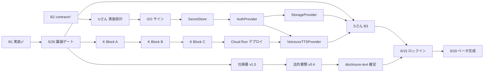

# InvokeAide 工程マップ v0.1

## 0. このマップについて

### 0.1 目的

2026-06-20 ベータ v1.0 完成から逆算した工程を、Sさん(実装)・Uさん(実装補助 / インフラ)・Tさん(品質)・たかしさん(オーナー作業 + ダメ出し)の **4 ストリームを 1 枚に統合** し、クリティカルパスと並行可能箇所を可視化する。

技術顧問のスケジュール管理の土台として運用し、進捗確定時に v0.2 / v0.3 と更新する。

### 0.2 想定読者と更新運用

- 読者: たかしさん / 技術顧問(新担当) / Sさん / Tさん
- 媒体: Markdown(`docs/Phase2/` 配下、Git 履歴管理)
- 更新トリガー: Sprint クロージング(5/26) / 大きなブロッカー発生 / 6/20 1 週間前のリスク再評価
- 「未来の自分を縛らない」原則: 期日は **目安(target)** として記録、確定値は完了時点で確定マークを付ける

### 0.3 4 ストリーム

| ストリーム | 主担当 | 守備範囲 |
|---|---|---|
| **S ストリーム** | Sさん | Vue 3 アプリ本体実装(B1/B2/B3)、ロジック品質 4 本、contract 起草 |
| **U ストリーム** | Uさん | Provider 実装(SecretStore / AuthProvider / StorageProvider / TTSProvider)、インフラ層(VOICEVOX Cloud Run / WIF / docker-compose)、整合レビュー |
| **T ストリーム** | Tさん | テスト整備、scaffolding 維持、Sprint 1 統合レビュー(11本) |
| **K ストリーム** | たかしさん | Block A-D 実施、仕様判断、ダメ出し |

---

## 1. ベータ完成までのカレンダー(週単位)

```
 W21      W22      W22      W23      W24      W25      W26      W27
 5/24-25  5/26-30  5/31-6/6 6/7-13   6/14-20  6/21-27  6/28-7/3 7/4-5
 [週末]   [Sprint2前半][Sprint2後半][Sprint3前半][Sprint3後半 + 仕上げ][ダメ出し前半][ダメ出し後半][配布]
 ━━━━━━━━━━━━━━━━━━━━━━━━━━━━━━━━━━━━━━━━━━━━━━━━━━━━━━━━━━━━━━━━━━━━━━━━━━━━━━━━━━━━━━━━━━━━━
 |        |        |        |        |        |        |        |
 ●━━●     ●━━━━━━━━●━━━━━━━━●━━━━━━━━●        ●━━━━━━━●━━━━━●  ●
 5/24      5/26    6/1?     6/8?     6/15?   6/20    6/21    7/3 7/4
 工程マ    Sprint  Sprint   Sprint  ベータ   ベータ  ダメ出  ダメ 家族
 ップ起    2 スコ  2 中間   3 開始  実装    v1.0    し開始  出し 配布
 草        ープ    レビュー         ロック  完成    (~14日) 完了
 (今日)    議論                    イン
```

凡例: ● = 確定マイルストーン、━ = 期間。日付に「?」付きは 5/26 議論で確定する想定。

### 1.1 主要マイルストーン

| # | 日付(目安) | マイルストーン | 担当 | 状態 |
|---|---|---|---|---|
| M1 | 2026-05-24(土) | B1 実装完了(Sさん) | Sさん | ✅ 実装完了、Tさん テスト修正待ち |
| M2 | 2026-05-24(土) | B2 contract 起草完了 | Sさん | ✅ 完了(前倒し) |
| M3 | 2026-05-24(土) | 工程マップ v0.1 起草 | Uさん | 🔄 進行中(本書) |
| M4 | 2026-05-25(日) | Block A-D 棚卸し v0.1 + 実装設計 v0.1 | Uさん | ⏳ 予定 |
| M5 | 2026-05-26(火) | **Sprint 1 クローズ + Sprint 2 スコープ議論** | 全員 | 🔴 ゲート |
| M6 | 5/26 〜 6/1 想定 | Sprint 2 着手 | 全員 | ⏳ 予定 |
| M7 | 6/8 前後 想定 | Sprint 2 中間レビュー(v1.5 進捗) | 技術顧問 | ⏳ 予定 |
| M8 | 6/15 前後 想定 | **ベータ実装ロックイン**(以降は微調整のみ) | 全員 | 🔴 ゲート |
| M9 | **2026-06-20**(土) | **ベータ v1.0 完成** | 全員 | 🔴 ゲート |
| M10 | 2026-06-21 〜 7-03 | たかしさんダメ出し期間(約 14 日) | たかしさん | ⏳ 予定 |
| M11 | **2026-07-04/05** | **家族配布** | たかしさん | 🔴 ゲート |

### 1.2 ゲート定義

🔴 **ゲート**: 通過確認なしに次フェーズに進まない節目。

- **M5(5/26)**: Sprint 2 スコープの確定。v1.5 起草担当・仕様書改訂対象・法的書類 A 案ドラフト本文起草タイミング・Provider 実装の優先順を確定。
- **M8(6/15 想定)**: ベータ実装ロックイン。新機能追加停止、バグ修正と UX 微調整のみに移行。
- **M9(6/20)**: ベータ v1.0 完成。たかしさん検証可能な状態。
- **M11(7/4-5)**: 家族配布。法務要件(同意フロー / AI 明示宣言 / 年齢確認)実装が完了している必要。

---

## 2. 4 ストリーム並行図(2026-05-24 → 2026-06-20)

```
                          5/24    5/26    6/1     6/8     6/15    6/20
                          [今]    [ゲート]                [LOCK]  [完成]
                          ━━━━━━━━━━━━━━━━━━━━━━━━━━━━━━━━━━━━━━━━━━━━
S(Sさん 実装)             B1✅     ─→     B2 着手   ─→     B3      ─→ 仕上げ
                                          (Provider                            
                                          実装は U)                            
                                                                              
                          B1 完了           ┊                                  
                          (Tテスト                                        
                          修正待ち)                                            
                                                                              
U(Uさん 実装+インフラ)    工程マップ        実装設計 →      Provider →     統合 →
                          Block A-D 棚卸     SecretStore     実装本体        テスト
                          実装設計起草       AuthProvider                       
                          (今週末)          StorageProv                       
                                            VoicevoxTTS                       
                                            (Sさん 補足                         
                                            メモ +                             
                                            設計→GO→実装)                       
                                                                              
                                                              ┊ ←Cloud Run     
                                                              ┊  デプロイ完了   
                                                              ┊                
                          Cloud Run 系: Block A-D 実行 (K) → WIF → デプロイ → 動作確認
                                                                              
T(Tさん 品質)             テスト修正        統合レビュー       テスト維持      E2E
                          (Pinia +         11本完了            (Provider       テスト
                          Router ハーネス)  (Sさん4本+         実装にテスト    本番
                                            Uさん7本)         を併走)         相当
                                                                              
K(たかしさん)             仕様判断          Block A 開始       Block B 開始    ダメ出し
                          (Q-U-h 等)        (規約確認)         (GCP セット     開始は
                                            (60 分目安)       アップ)         M10
                                                              (30 分目安)     
                                                              Block C 開始    
                                                              (WIF 設定)      
                                                              (60 分目安)     
```

### 2.1 ストリーム間の依存(矢印 = 依存先)

```
┌────────────────────────────────────────────────────────────────┐
│  Sさん B1 ✅                                                    │
│       ↓                                                         │
│  Sさん B2 contract ✅ ─────→ Uさん 実装設計 → Uさん 実装本体    │
│                                          ↑                      │
│                                       (GO サイン)               │
│  Sさん B3 ──→                                                  │
│                                                                 │
│  K Block A ──→ K Block B ──→ K Block C ──→ Cloud Run デプロイ  │
│  (規約確認)    (GCP)        (WIF)         ↓                    │
│                                            VoicevoxTTSProv 動作 │
│                                            ↓                    │
│                                            ベータで音声利用可    │
│                                                                 │
│  M5 5/26 議論 ──→ 仕様書 v1.5 ──→ AI 明示宣言文言 / 年齢確認   │
│                   (新担当起草)     UI 実装 (Sさん or Uさん)     │
└────────────────────────────────────────────────────────────────┘
```

---

## 3. クリティカルパス特定

### 3.1 6/20 ベータ完成までの 3 本のクリティカルパス

複数のクリティカルパスが並走している。1 本でも遅れると 6/20 完成は怪しくなる。

#### CP-1: アプリ実装パス(Sさん + Uさん の本流)

```
B2 contract ✅
    ↓
Uさん 実装設計 起草(今週末、~5/25)
    ↓
GO サイン (新担当)
    ↓
SecretStore 実装 → AuthProvider 実装 → StorageProvider 実装
    ↓                                       ↓
    ↓                              Drive API 統合動作確認
    ↓
VoicevoxTTSProvider 実装(Cloud Run デプロイと並行可)
    ↓
B3 統合(Sさん) — アプリで全 Provider を組み合わせて動かす
    ↓
E2E テスト(Tさん)
    ↓
ベータ v1.0
```

**ボトルネック候補**:
- Uさん 実装設計 → GO サイン待ちの時間(設計品質次第)
- StorageProvider Drive 統合は LWW + ETag 競合解決の実装複雑度が高い
- WebSpeechTTSProvider は contract §6.2 論点未解決のため除外、案 X/Y/Z 確定待ち

#### CP-2: VOICEVOX Cloud Run パス(K + U の連携)

```
たかしさん Block A(規約確認、30-60 分)
    ↓
たかしさん Block B(GCP アカウント、30 分)
    ↓
たかしさん Block C(WIF + GitHub Secrets、30-60 分、Uさん 手順書あり)
    ↓
GitHub Actions ワークフロー実行(Uさん 起草済、本番デプロイ)
    ↓
VOICEVOX Cloud Run 稼働確認
    ↓
VoicevoxTTSProvider 結線 → ベータで音声合成利用可
```

**ボトルネック候補**:
- Block A-C はたかしさんの手隙時間に依存。**5/26 議論で Block A 開始日を確定したい**
- 並列着手可能(Uさん は Provider 実装、K は Block を別途並行)

#### CP-3: 法務必須要件パス(新担当 + Sさん の連携)

```
M5 5/26 議論
    ↓
仕様書 v1.5 起草(担当・スコープ確定、新担当主導)
    ↓
法的書類 v0.4(AI 明示宣言文言 / 年齢確認文言 / 同意フロー文言の確定)
    ↓
B1 disclosure-text.ts に確定文言を反映(Sさん)
    ↓
年齢確認モーダル実装(Sさん 領域)
    ↓
同意フロー実装(Sさん 領域、規約改訂時の再同意基盤含む)
    ↓
ベータ配布前必須要件クリア
```

**ボトルネック候補**:
- v1.5 / v0.4 起草担当が未確定 → M5 で必ず決める(本書 §1.1 / 論点リスト v0.2 Q-U-h-4)
- B1 disclosure-text.ts は分離済み(Sさん の判断、good design)→ 文言確定だけで反映可能

### 3.2 クリティカルパスの収束点

```
6/15 想定 (M8 ベータ実装ロックイン) で 3 本が収束:
    CP-1: 全 Provider 実装 + B3 統合完了
    CP-2: Cloud Run 稼働 + VoicevoxTTSProvider 結線完了
    CP-3: 法務必須要件(同意フロー / AI 明示宣言 / 年齢確認)実装完了
            ↓
        全て揃って初めて、6/15 → 6/20 の 5 日間で
        実機テスト + UX 微調整 + ベータ仕上げが可能
```

---

## 4. 並行可能箇所(リソース効率最大化)

### 4.1 5/24-5/25(週末)

| 担当 | タスク | 並行性 |
|---|---|---|
| Sさん | B1 完了報告本番化(Tさん テスト修正完了後) | T 修正待ちの間も他作業可 |
| Tさん | tests/unit/App.test.ts の Pinia + Router ハーネス追加 | 単独完結 |
| Uさん | 工程マップ起草 → Block A-D 棚卸し → 実装設計起草 | 単独完結、Sさん contract 既受領 |
| K(たかしさん) | Q-U-h 確定済、Sprint 2 スコープ議論準備(5/26 当日まで) | — |

### 4.2 5/26-5/31(Sprint 2 前半)

| 担当 | タスク | 並行性 |
|---|---|---|
| Sさん | B3 着手(Sprint 2 スコープ確定後)、disclosure-text.ts への確定文言反映 | U と独立 |
| Uさん | Provider 実装着手(GO サイン後): SecretStore → AuthProvider | S と独立 |
| Tさん | Sprint 1 統合レビュー 11 本(5/26 まで継続中) | 単独完結 |
| K | Block A 着手(規約確認、Web 調査 30-60 分) | 他と独立、いつでも |
| 新担当 | 仕様書 v1.5 起草 / 法的書類 A 案ドラフト本文起草 | 全員と独立 |

### 4.3 6/1-6/14(Sprint 2 後半 + Sprint 3)

| 担当 | タスク | 並行性 |
|---|---|---|
| Sさん | B3 統合 + 年齢確認モーダル実装 + 同意フロー実装 | U と独立(contract 経由) |
| Uさん | StorageProvider 実装 + VoicevoxTTSProvider 実装 | S と独立、ただし Cloud Run デプロイ完了が VoicevoxTTSProvider 動作確認の前提 |
| Tさん | テスト併走、E2E テスト整備 | 実装ストリームと並走 |
| K | Block B(GCP) → Block C(WIF)実施、GitHub Secrets 設定 | 他と独立、ただし VoicevoxTTSProvider 動作確認の前提 |

### 4.4 並行性を最大化するコツ

- **Block A-C をたかしさんの隙間時間に分散**: 一日 1 Block(30-60 分)ずつ進めれば 3 日で完了、6/14 までに余裕で間に合う
- **Provider 実装は依存順** (Secret → Auth → Storage / TTS)を守ればストリーム内並列化は限定的だが、S ストリームと完全独立
- **テストは「contract が固まった瞬間」から書ける**: Tさん は contract を読んで mock を起こせる、実装完了を待たない
- **Cloud Run デプロイは Block C 完了即実行可能**: Uさん が手順書を握っているので、Block C 終了の瞬間にデプロイを走らせる(技術顧問の段取り次第)

---

## 5. リスクと依存関係

### 5.1 リスクレジスタ

| # | リスク | 影響 | 緩和策 | 担当 |
|---|---|---|---|---|
| R1 | Tさん テスト修正が長引き B1 完了報告本番化が遅延 | M5 までに B1 確定できないと B3 着手判断が遅れる | 技術顧問経由で Tさん に進捗確認、必要なら Sさん が暫定 helper を提供 | 技術顧問 |
| R2 | Block A 規約確認で「サーバーサイド配信形態」 が VOICEVOX 利用規約上不可と判明 | Cloud Run 経路全体が破綻、Web Speech フォールバック単独運用へ | Block A を Sprint 2 最初に着手して早期検出、案 X(WebSpeech 単独)で fallback | K + 技術顧問 |
| R3 | WebSpeechTTSProvider contract §6.2 論点(案 X/Y/Z)が未解決のまま 6/15 に到達 | iOS Safari など VOICEVOX 不通時のフォールバックが動かない | 5/26 議論枠で Sさん の確定を促す | Sさん + 技術顧問 |
| R4 | Drive API 統合(StorageProvider)の LWW + ETag 競合解決実装が想定より複雑 | StorageProvider 実装が CP-1 のボトルネックに | Uさん の実装設計で先行設計、Sさん 補足メモを使って想定外を減らす | Uさん |
| R5 | 法的書類 v0.4 確定文言の起草が新担当の他業務で遅延 | B1 disclosure-text.ts に確定文言を入れられず、ベータ配布要件未達 | 新担当のキャパを 5/26 議論で確認、Sさん / Uさん が起草補助できる範囲を提示 | 新担当 + 技術顧問 |
| R6 | たかしさん Block A-D 着手が 6/14 以降にずれ込む | Cloud Run デプロイ間に合わず、VoicevoxTTSProvider が動かないままベータ | Block A は 5/26 議論直後、Block B/C は 6/7 までに完了を目標化 | K + 技術顧問 |
| R7 | 仕様書 v1.5 と Sさん 実装の整合性で手戻り | B3 統合段階で仕様未確定が露呈し、再実装 | 5/26 で v1.5 スコープ確定、Sさん は contract に書き込み、v1.5 が contract と矛盾しないよう新担当が起草時参照 | 新担当 + Sさん |

### 5.2 依存関係グラフ(Mermaid)



---

## 6. たかしさん作業のタイムライン

技術顧問のスケジュール管理用に、たかしさん作業を時系列で集約。

| 期間 | Block | 内容 | 見込み時間 | 完了条件 |
|---|---|---|---|---|
| 5/26 直後 | A | VOICEVOX 規約 + キャラ規約確認 + クレジット表記合意 | 60 分(Web 調査) | A-1〜A-5 全項目確認、エルトン後継=新担当と A-5 を合意 |
| 5/31 までに | B | Google Cloud Console でプロジェクト作成 + 課金紐付け + 予算アラート + API 有効化 + リージョン選定 | 30 分 | B-1〜B-5 完了、Cloud Run / Cloud Build / IAM / Artifact Registry API 有効 |
| 6/7 までに | C | WIF 設定 + GitHub Secrets 設定(Uさん 手順書あり) | 60 分(初設定の場合)、30 分(手順書通り) | C-1〜C-3 完了、GitHub Actions で WIF 認証成功 |
| 6/20 まで(任意) | D | カスタムドメイン判断 | ベータでは 0 分(D-1 のみ、Cloud Run 標準 URL で OK) | D-1 のみ |

**合計**: 90-150 分のたかしさん作業を、5/26 〜 6/7 の約 12 日間に分散すれば 1 日あたり 10-15 分。**6/7 までに Block A-C 完了が CP-2 の最遅期限。**

詳細は別途、本日着手の「Block A-D 棚卸し」で各 Block の依頼内容を箇条書き化する(Uさん タスク #21、本書と同日成果物予定)。

---

## 7. 6/20 〜 7/4 のダメ出し期間運用

### 7.1 たかしさんダメ出し(M10、約 14 日)

- 期間: 2026-06-21 〜 2026-07-03(13 日間)
- ペース: 1 日 1 件以上の指摘 → Sさん / Uさん が即対応
- スコープ: 機能追加は原則禁止、UX 微調整・バグ修正・文言調整のみ
- 法務要件未達があれば 7/4 配布をスライド

### 7.2 配布前最終チェック(7/3 想定)

| 項目 | 担当 | 確定すべきこと |
|---|---|---|
| 起動時 AI 明示宣言の表示 | Sさん | 文言が法的書類 v0.4 / 仕様書 v1.5 と一致 |
| 年齢確認フロー | Sさん | 13 歳未満ブロック動作、13-18 歳保護者同意動作 |
| 規約同意フロー | Sさん | 初回 + 規約改訂時の再同意動作 |
| VoicevoxTTSProvider | Uさん | Cloud Run 稼働中、フォールバック動作 |
| StorageProvider | Uさん | Drive 拒否時の動作、競合時の retainedPath |
| 各キャラ規約クレジット | K + Sさん | UI に表示されている文字列が正確 |

---

## 8. 次のアクション(本書配布直後)

### 8.1 5/24(本日)

- [x] 工程マップ v0.1 起草(本書、Uさん)
- [ ] Block A-D 棚卸し v0.1 起草(Uさん、優先2)
- [ ] 実装設計 v0.1 起草(Uさん、優先3、SecretStore / AuthProvider / StorageProvider / VoicevoxTTSProvider)
- [ ] Tさん テスト修正完了見込み(技術顧問経由)
- [ ] B1 完了報告本番化(Sさん、Tさん 修正完了後)

### 8.2 5/25(明日)

- [ ] Uさん 優先2 / 優先3 残り作業
- [ ] 技術顧問: 工程マップ v0.1 レビュー、Sさん / Tさん 共有可否判断

### 8.3 5/26(Sprint 1 クローズ + Sprint 2 スコープ議論)

- 議論項目(論点リスト v0.2 §5.3 議論順序案):
  1. 🔴 高優先 12 件(L-A-1, L-A-3, L-A-4, L-A-5, L-A-6, L-A-11, L-A-13, L-B-4, L-B-7, L-B-8, L-B-10, L-C-7, L-C-13)
  2. **v1.5 起草担当の確定**(Q-U-h-4)
  3. **Block A 開始日の確定**(本書 §6 / R6)
  4. **WebSpeechTTSProvider 案 X/Y/Z の確定**(B2 引き継ぎメモ §6.2 / R3)
  5. **法的書類 v0.4 起草スコープと担当の確定**(R5)

### 8.4 本書の次バージョン

- **v0.2 更新トリガー**: Sprint 2 スコープ議論(5/26)直後、確定事項を反映
- **v0.3 更新トリガー**: Sprint 2 中間レビュー(6/8 想定)
- **v0.4 更新トリガー**: M8 ロックイン直後(6/15 想定)、リスク再評価
- **v1.0 確定**: ベータ完成(6/20)時点で工程マップを「実績版」として確定

---

## 9. 統計

### 9.1 4 ストリームの 2026-05-24 時点累積工数(設計起草 + 実装 + テスト)

| ストリーム | 起草・実装ファイル数 | 累積工数(概算) | 残工数(概算、6/20 まで) |
|---|---|---|---|
| S | 4 (ロジック品質) + 6 (B2 contract) + 1 (B1 実装) = 11 | ~20-25 時間 | ~80-120 時間(B3 + 法務関連) |
| U | 7 (Sprint 1 起草) + 2 (整合レビュー) + 1 (工程マップ) = 10 | ~12 時間 (Sprint 1) + 3 時間 (整合) + 0.3 時間 (工程マップ起草中) | ~60-100 時間(Provider 実装 + 統合) |
| T | 1 (scaffolding) + テスト修正 + 統合レビュー 11 本 | ~5-8 時間 + 進行中 | ~40-60 時間(テスト整備 + E2E + 統合レビュー残) |
| K | Block 未着手 + 仕様判断対応 | ~5-10 時間(Q-U-g/h 等の判断時間) | ~5-10 時間(Block A-D)+ 14 日 ダメ出し |

### 9.2 6/20 までの稼働日

5/24 → 6/20 = **27 日**(うち 4 週末 = 8 日、平日 19 日)。Sさん / Uさん は週末・平日とも稼働可能(エージェント特性)、K + 新担当は平日中心。

---

## 10. 変更履歴

| Version | 日付 | 主な変更 | 起草者 |
|---|---|---|---|
| v0.1 | 2026-05-24(土) | 初版作成。4 ストリーム並行図、3 本のクリティカルパス、リスクレジスタ 7 件、たかしさん作業タイムライン、Sprint 2 議論項目 5 件 | Uさん(Opus) |

---

— Uさん(2026-05-24、6/20 ベータ完成までの統合工程マップ v0.1 起草)
